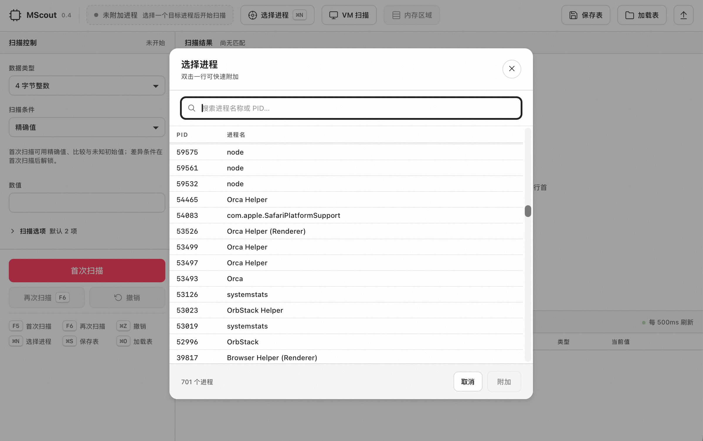
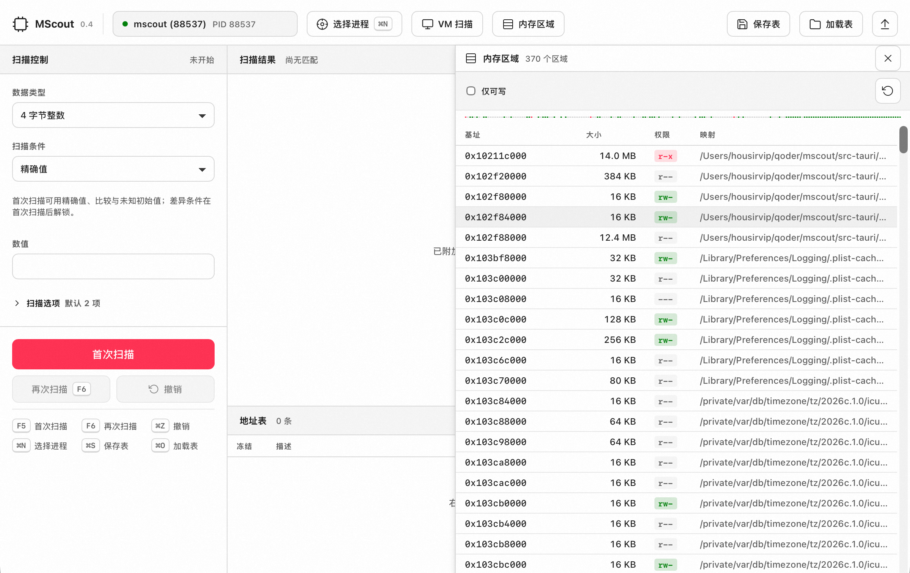

# MScout

A cross-platform memory scanner for game hacking and reverse engineering.  
Like Cheat Engine, but runs natively on macOS, Windows, and Linux — with both a GUI and a headless CLI.

[中文](./README_CN.md)






## Features

- **Process attachment** — attach to any running process by PID
- **Memory scanning** — iterative scan with 11 conditions (Exact, GreaterThan, LessThan, Between, Changed, Unchanged, Increased, Decreased, IncreasedBy, DecreasedBy, Unknown)
- **Value types** — I8 / I16 / I32 / I64 / U8 / U16 / U32 / U64 / F32 / F64 / ByteArray (wildcard AOB)
- **Value freezing** — lock addresses to a value with a background write loop
- **Pointer scanning** — BFS-based pointer chain finder with configurable depth and offset
- **Cheat tables** — save/load `.mst` files (JSON-based, supports static & pointer addresses)
- **Memory viewer** — hex editor with real-time refresh
- **Region browser** — visualize memory layout with permission color coding
- **VM introspection** — scan VMware / Hyper-V guest memory without guest-side tools
- **CLI** — full-featured command-line interface for scripting and AI agent automation
- **Cross-platform** — macOS, Windows, Linux
- **Bilingual UI** — English & Chinese

## Tech Stack

| Layer | Stack |
|-------|-------|
| Core | Rust (mscout-core) — platform abstraction, scanner engine, pointer scanner, freeze, VM |
| GUI | Tauri 2 + React 19 + TypeScript + Vite |
| CLI | Rust (clap) — subcommand mode + interactive REPL |
| Platforms | macOS (mach2), Windows (Win32 API), Linux (/proc) |

## Prerequisites

- **Rust** toolchain (stable)
- **Node.js** ≥ 18 (for GUI only)
- Platform-specific requirements:
  - **macOS** — disable SIP, or sign the binary with `com.apple.security.cs.debugger` entitlement
  - **Linux** — run with `sudo`, or grant `CAP_SYS_PTRACE` capability
  - **Windows** — run as Administrator

## Quick Start

### GUI

```bash
git clone https://github.com/housirvip/mscout.git
cd mscout
npm install
npm run tauri dev
```

Production build:

```bash
npm run tauri build
```

### CLI

```bash
cargo build -p mscout-cli --release
# Binary at: target/release/mscout
```

Or run directly:

```bash
cargo run -p mscout-cli -- ps --filter "game"
```

## CLI Usage

The CLI exposes all core capabilities for terminal use, scripting, and AI agent automation.

```bash
# List processes
mscout ps --filter "game" --json

# Attach to a process
mscout attach 12345

# Scan for a value
mscout scan 1000 --type i32 --cond eq --json

# Narrow results after value changes
mscout next 950 --cond eq --json

# View results
mscout results --limit 20

# Read/write memory
mscout read 0x7FFF1234 --type i32
mscout write 0x7FFF1234 99999 --type i32

# Freeze a value
mscout freeze 0x7FFF1234 99999 --type i32 --label "gold"

# Pointer scan
mscout pointer-scan 0x7FFF1234 --depth 4 --max-offset 4096

# Hex dump
mscout hex 0x7FFF1234 --len 256

# Memory regions
mscout regions --perm rw

# VM introspection
mscout vm list
mscout vm attach-process 5678 1234

# Cheat table
mscout table save game.mst
mscout table load game.mst

# Interactive REPL (for AI agents)
mscout repl --json

# Detach
mscout detach
```

All commands support `--json` for machine-readable output. See [`docs/skill-mscout-cli.md`](docs/skill-mscout-cli.md) for the full reference.

## GUI Usage

1. Launch MScout → pick a process from the process list
2. Set value type and scan condition → **First Scan**
3. Change the value in-game → **Next Scan** to narrow results
4. Right-click a result → **Add to Address Table**
5. Freeze or modify the value
6. Save as `.mst` cheat table for later

### Keyboard Shortcuts

| Shortcut | Action |
|----------|--------|
| F5 | First Scan |
| F6 | Next Scan |
| ⌘/Ctrl+Z | Undo Scan |
| ⌘/Ctrl+N | New Scan (reset) |
| ⌘/Ctrl+S | Save Table |
| ⌘/Ctrl+O | Load Table |

## Project Structure

```
mscout/
├── crates/
│   ├── mscout-core/      # Core library (platform, scanner, pointer, freeze, vm)
│   └── mscout-cli/       # CLI binary (subcommand + REPL)
├── src-tauri/            # Tauri app shell + Rust IPC commands
│   └── src/commands/     # GUI command handlers
├── src/                  # React frontend
├── docs/
│   └── skill-mscout-cli.md  # AI agent skill reference
├── Cargo.toml            # Workspace root
└── package.json
```

## Architecture

```
┌─────────────────────────────────────────────────┐
│                 mscout-core                      │
│  (platform abstraction, scanner, pointer,       │
│   freeze, cheat table, VM introspection)        │
└──────────────┬───────────────────┬──────────────┘
               │                   │
    ┌──────────▼──────────┐  ┌────▼─────────────┐
    │    src-tauri (GUI)   │  │  mscout-cli (CLI) │
    │  Tauri 2 + React 19  │  │  clap + REPL      │
    └──────────────────────┘  └──────────────────┘
```

Both the GUI and CLI consume `mscout-core` directly — zero IPC overhead for CLI, Tauri IPC for GUI.

## License

MIT License — see [LICENSE](LICENSE) for details.
